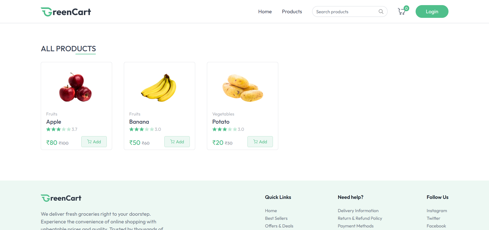
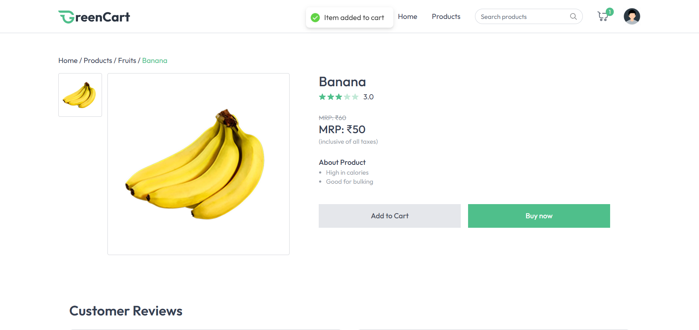
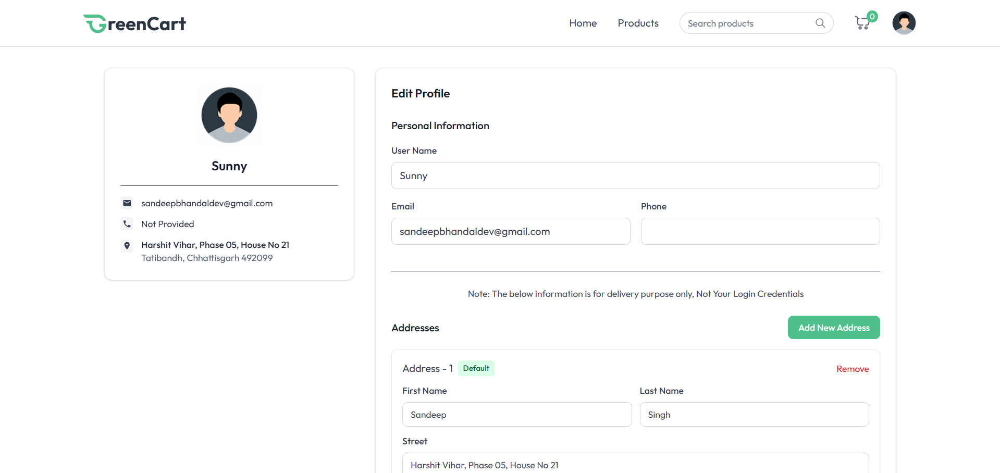
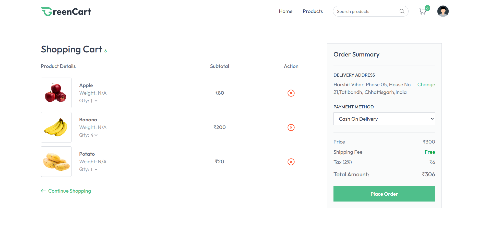
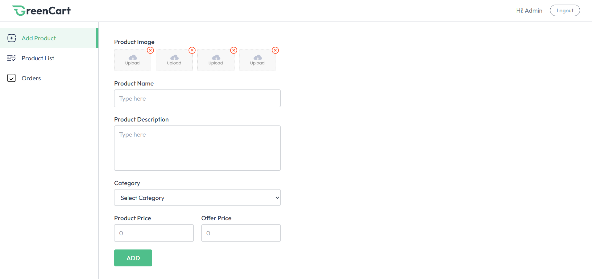
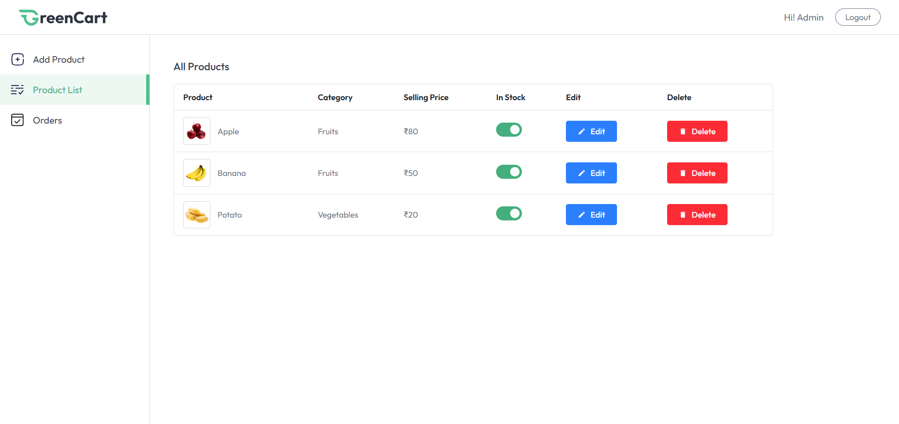
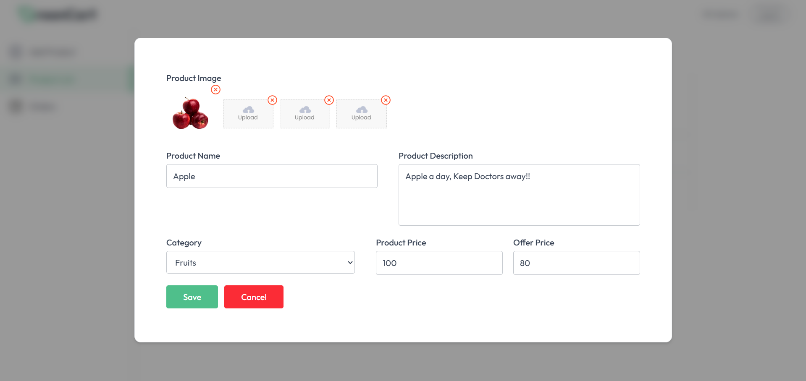
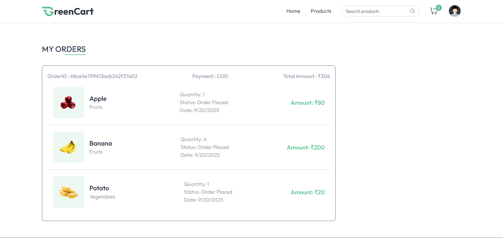

# 🛒 Full-Stack E-Commerce Web Application

A **full-featured E-Commerce platform** built with the **MERN stack**.  
Enjoy a smooth shopping experience as a user and a powerful dashboard as a seller to manage products and orders.

---

## 🌐 Live Demo

[💻 View Live Project](https://full-stack-grocery-delivery-web-app.vercel.app/)

---

## 🚀 Features

### 👤 User Features

- 🔐 **Authentication:** Login / Register
- 🔎 **Search Products:** Quickly find products by name or category
- 🗂️ **Categories:** Organized product browsing
- 📄 **Product Details:** Images, description, prices
- 🛒 **Cart Management:** Add, remove single or multiple items
- ⭐ **Reviews:** Add reviews with like/dislike functionality
- 🔗 **Related Products:** Smart suggestions
- 🔑 **Forgot Password:** Recover account easily
- 👤 **Profile Management:** Update your profile
- 🗑️ **Delete Account:** Permanently remove account
- 📦 **Orders Page:** View past orders
- 🚪 **Logout:** Securely end session

### 🛍️ Seller Features

- 🖥️ **Seller Dashboard:** Dedicated seller panel
- ➕ **Add Product:** Upload new products with images & details
- ✏️ **Manage Products:** Edit, delete, view products
- 📦 **View Orders:** Track orders for seller’s products

---

## 🛠️ Tech Stack

| Layer      | Technologies                        |
| ---------- | ----------------------------------- |
| Frontend   | React.js, Tailwind CSS, Prebuilt UI |
| Backend    | Node.js, Express.js, Zod            |
| Database   | MongoDB                             |
| State Mgmt | Context API                         |
| Auth       | JWT & Cookies                       |

---

## 🔮 Future Improvements

- Payment Gateway Integration (Razorpay / Stripe) 💳
- Wishlist / Favorites ❤️
- Advanced Filtering (Price, Rating, Category) 🔍

---

## ⚙️ Installation & Setup

1. Clone the repository:

   ```bash
   git clone https://github.com/sandeep-singh-bhandal/Full_Stack_Grocery_Delivery_Web_App.git

   cd ecommerce-project
   ```

2. Install dependencies

   For backend

   ```bash
   cd backend
   npm install
   ```

   For frontend

   ```bash
   cd frontend
   npm install
   ```

3. Add .env file in the backend and frontend folder

   For Backend

   ```bash
   #Port for your backend
   PORT=3000

   #Your JWT Secret Key to encode and decode JWT token
   JWT_SECRET_KEY=your_jwt_secret

   NODE_ENV=development

   #MONGO DB connection string to connect to the database
   MONGODB_URI=your_mongodb_connection_string

   #Seller credentials to login to the seller page
   SELLER_EMAIL=your_seller_email
   SELLER_PASSWORD=your_seller_password

   #CLludinary for image uploads
   CLOUDINARY_CLOUD_NAME=your_cloudinary_name
   CLOUDINARY_API_KEY=your_api_key
   CLOUDINARY_API_SECRET=your_api_secret

   #SMTP details to send mails
   SMTP_USER=your_smtp_user
   SMTP_PASS=your_smtp_password
   ```

   For Frontend

   ```bash
   #Currency for the frontend
   VITE_CURRENCY=₹

   #Backend Url
   VITE_BACKEND_URL=http://localhost:3000
   ```

4. Run the project

   Run backend

   ```bash
   cd backend
   npm run dev
   ```

   Run frontend

   ```bash
   cd frontend
   npm run dev
   ```

# Project Screenshots

### 1. Homepage


### 2. Products Page



### 3. Product's Details



### 4. Customer's Reviews


### 5. Profile Page



### 6. Cart Page



### 7. Seller's Add Product Page



### 8. Seller's Products List Page



### 9. Product Edit



### 10. Orders Page


